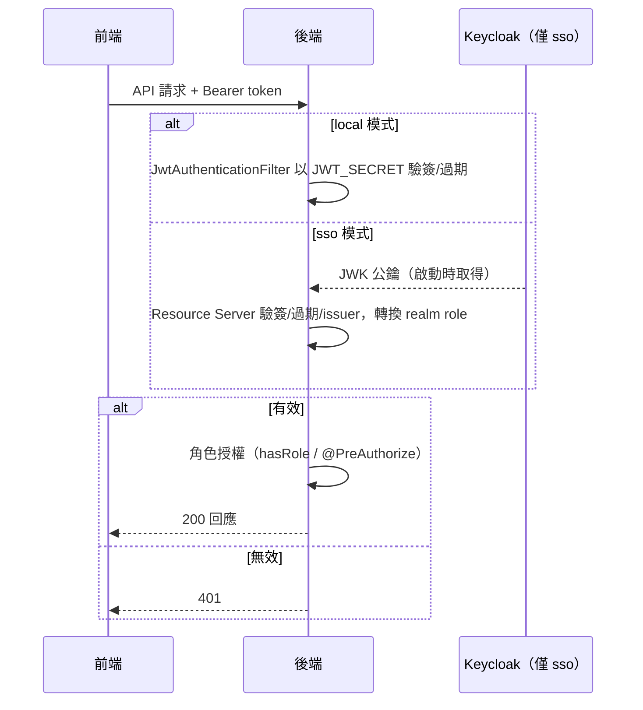
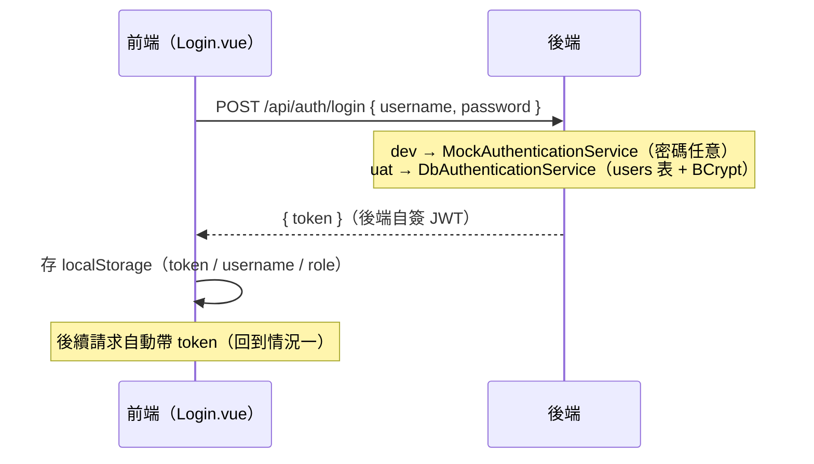
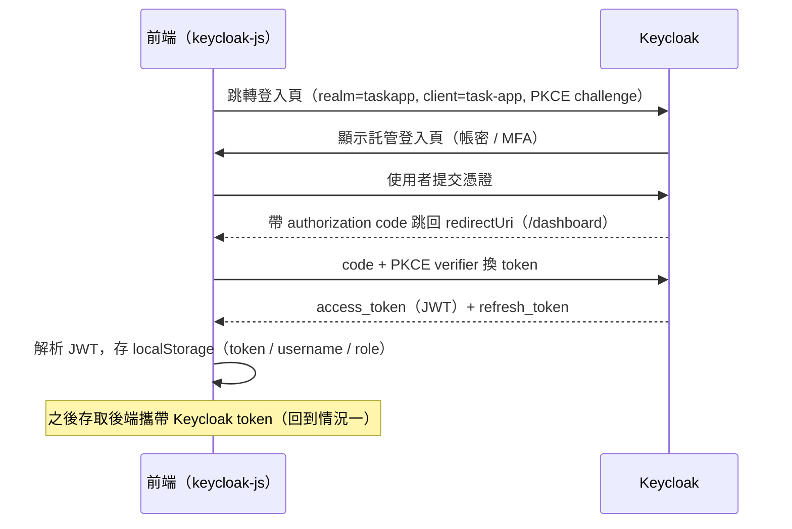

# 認證流程梳理（local / SSO）

本文件梳理前端、後端與 Keycloak 之間的認證與授權流程，對應 `sso` 分支的實作。

## 1. 兩個正交維度：isSso 與 isLogin

`isSso` 與 `isLogin` 不是「or」關係，而是兩個獨立維度：

| 概念 | 變數 | 回答的問題 | 何時確定 |
|---|---|---|---|
| 認證模式 | `isSso()`（`local` / `sso`） | 用**哪種方式**登入？ | App 啟動時查詢後端 `GET /api/auth/config` |
| 登入狀態 | `isAuthenticated()`（有無 token） | **現在**有沒有有效憑證？ | 每次跳頁 / 發請求時即時判斷 |

2×2 組合：

```text
              未登入(isLogin=false)       已登入(isLogin=true)
local 模式    → 跳自訂登入頁               → 帶自簽 JWT 存取
sso   模式    → 跳 Keycloak 登入頁         → 帶 Keycloak JWT 存取
```

真正的分支條件是 **isLogin（有沒有 token）**；`isSso` 只在「沒有 token、要去登入」時決定導向哪個登入頁。

## 2. 啟動階段：發現認證模式

```text
App 啟動
  ├─ GET /api/auth/config ──► { mode: local | sso, keycloakUrl, realm, clientId }
  │                            （local 模式下 keycloak 欄位為空）
  └─ sso 模式另做 check-sso：若 Keycloak 已有 SSO session，靜默直接登入
     （在其他系統已登入同一個 Keycloak 時，打開本應用不需再登入一次）
```

## 3. 情況一：有 token —— 存取鏈路

```text
前端 axios 攔截器
  └─ 自動加上 Authorization: Bearer <token>      （local / sso 皆同）
        ▼
後端 Security Filter Chain（真正的安全把關者）
  ├─ local（dev/uat）：JwtAuthenticationFilter
  │     以 JWT_SECRET（HMAC 對稱金鑰）驗簽 + 驗過期，讀出 username / role
  └─ sso（prod）：OAuth2 Resource Server
        以 Keycloak 的 JWK 公鑰驗簽 + 驗過期 + 驗 issuer
        KeycloakRoleConverter 從 realm_access.roles 取出 ADMIN / USER
        ▼
  有效 → 進入 Controller（@PreAuthorize / hasRole 再做角色授權）
  無效 / 過期 → 401
```

Token 簽發者的差異：

| | local（dev/uat） | sso（prod） |
|---|---|---|
| 誰驗證帳密 | 後端自己（mock，或查 users 表 + BCrypt） | Keycloak，後端完全不碰密碼 |
| 誰簽發 token | 後端 `JwtService` 自簽 | Keycloak 簽發 |
| 後端角色 | 認證 + 發 token + 驗 token | 只驗 token（Resource Server） |

SSO 模式下前端保存的 token 即為 **Keycloak token**，後端不另外自簽。

時序圖：



## 4. 情況二：無 token —— 登入鏈路

前端的兩道防線（路由守衛、登入頁）只負責 UX 導向，**並非安全邊界**。

```text
路由守衛 router.beforeEach（進入 /dashboard、/tasks、/users 前）
  └─ isAuthenticated()?
       ├─ 是 → 放行
       └─ 否 → login()
                ├─ sso：keycloak.login()，瀏覽器跳轉 Keycloak 託管登入頁
                └─ local：回 /login 自訂表單頁
```

### 4.1 Local 分支



### 4.2 SSO 分支（OIDC Authorization Code + PKCE）



換 token 是前端直接與 Keycloak 對話；後端全程不參與登入，直到前端呼叫 API 時才第一次看到 token（以公鑰驗簽）。

## 5. Token 過期：靜默更新

```text
請求收到 401
  ├─ sso：axios 攔截器先以 refresh_token 靜默 updateToken()
  │        成功 → 以新 token 自動重放失敗的請求（使用者無感）
  │        失敗 → Keycloak logout，回到登入流程
  └─ local：清除本地狀態，回 /login 重登
```

## 6. 登出差異

- local：僅清除 localStorage（自簽 JWT 在過期前理論上仍有效）
- sso：`keycloak.logout()` 除了清除本地 token，還會**結束 Keycloak SSO session**；否則再次登入會被靜默登入。共用同一個 Keycloak 的其他系統也會感知登出。

## 7. 安全邊界在後端

路由守衛與 localStorage 檢查只是「不讓使用者看到進不去的頁面」的 UX 手段。任何人以 curl / Postman 攜帶有效 token 都能直接呼叫 API；無 token 時是**後端 filter chain 回 401**，而非前端阻擋。

```text
前端跳轉（UX 層，可繞過）  +  後端驗證（安全層，不可繞過）
```

## 8. 一句話總結

> App 啟動先向後端確認使用 local 或 sso（**isSso**）；每個請求只要有 token（**isLogin**）就攜帶、由後端驗證；無 token 時，sso 跳 Keycloak、local 跳自訂登入頁，登入成功後保存（後端自簽或 Keycloak 簽發的）token 並重複使用；過期時以 refresh token 靜默更新；sso 登出需一併結束 Keycloak session。
